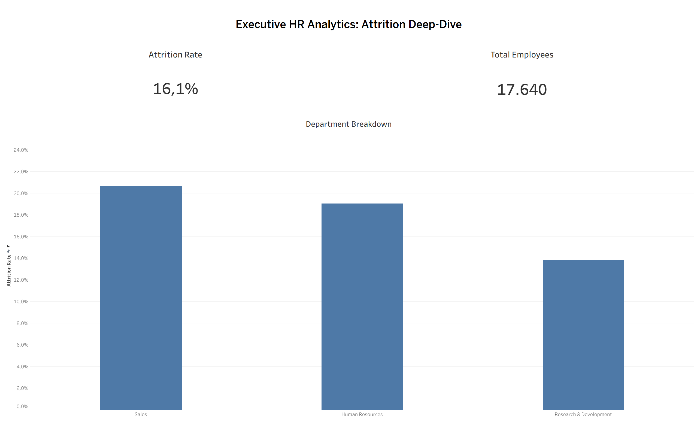

# 📊 HR Analytics Data Pipeline: Employee Attrition Deep-Dive

**Data Engineering Zoomcamp — Final Project**



---

## 🎯 Problem Statement

Employee attrition is one of the most expensive and disruptive challenges facing modern organizations. The cost of replacing a single employee can range from 50 % to 200 % of their annual salary when accounting for recruitment, onboarding, lost productivity, and institutional knowledge drain. Yet most HR departments still rely on reactive, manual reporting that only reveals attrition *after* it has already impacted the business.

**This project solves that problem** by building a fully automated, end-to-end batch data pipeline that:

1. **Ingests** the IBM HR Analytics Employee Attrition dataset (1,470 employee records with 35 attributes) into a cloud Data Lake.
2. **Loads** the raw data into a Data Warehouse for analytical querying.
3. **Transforms** the data using dbt into clean, optimized fact and dimension tables — with partitioning and clustering for cost-efficient queries.
4. **Visualizes** key attrition metrics in an interactive Streamlit dashboard, enabling HR leaders to instantly identify which departments, income brackets, and tenure milestones carry the highest turnover risk.

**Dataset:** [IBM HR Analytics Employee Attrition & Performance](https://www.kaggle.com/datasets/pavansubhasht/ibm-hr-analytics-attrition-dataset) (Kaggle)

---

## 🏗️ Architecture & Technologies

```
┌──────────────┐     ┌──────────────┐     ┌──────────────┐     ┌──────────────┐
│  Raw CSV     │────▶│  GCS Bucket  │────▶│  BigQuery    │────▶│  Streamlit   │
│  (data/)     │     │  (Data Lake) │     │  (DWH)       │     │  Dashboard   │
└──────────────┘     └──────────────┘     └──────────────┘     └──────────────┘
       │                    │                    │                    │
       └─── Kestra Orchestration (multi-step DAG) ──────────────────┘
                            │
                     dbt Transformations
                     (stg → dim → fct)
```

| Component | Technology |
|---|---|
| **Cloud** | Google Cloud Platform (GCP) |
| **Infrastructure as Code** | Terraform |
| **Orchestration** | Kestra (Docker) |
| **Data Lake** | Google Cloud Storage (GCS) |
| **Data Warehouse** | Google BigQuery |
| **Transformations** | dbt (Data Build Tool) |
| **Dashboard** | Streamlit (Dockerized) |
| **Containerization** | Docker & Docker Compose |

---

## 🗄️ Data Warehouse Design

### dbt Models (3-layer architecture)

| Model | Type | Description |
|---|---|---|
| `stg_hr_data` | View | Cleans raw data, standardizes to `snake_case`, casts types, generates `snapshot_date` |
| `dim_employees` | Table | Employee dimension with feature-engineered `income_bracket` and `tenure_category` columns |
| `fct_attrition_stats` | Table | Core fact table with binary `attrition_flag` for dashboard metrics |

### Optimization — Partitioning & Clustering

- **`fct_attrition_stats`** is **partitioned by `snapshot_date`** (daily granularity). When querying a specific date range, BigQuery only scans the relevant partitions, reducing cost and improving speed.
- **`fct_attrition_stats`** and **`dim_employees`** are **clustered by `department`**. Since the dashboard heavily filters and groups by department, clustering physically co-locates this data for faster reads.

---

## 📈 Dashboard

The Streamlit dashboard satisfies all project requirements with **3 interactive tiles**:

| Tile | Type | What it shows |
|---|---|---|
| **Attrition Rate by Department** | Bar chart | Categorical distribution — identifies Sales as the highest-risk department |
| **Attrition by Years at Company** | Line chart | Temporal distribution — reveals critical tenure milestones (1-2 years peak) |
| **Income Bracket vs Attrition** | Bar chart | Entry-level employees show significantly higher turnover |

Plus **KPI scorecards** showing Total Headcount, Attrition Count, and Global Attrition Rate.

---

## 🚀 How to Reproduce This Project (Step by Step)

> **Read every step carefully before running commands.** Each step tells you exactly what to type, what to change, and what to expect.

### What You Need Installed Before Starting

Make sure **all four** tools below are installed and working on your machine. Open a terminal and run each check command:

| Tool | Check command | Install link |
|---|---|---|
| **Git** | `git --version` | [git-scm.com](https://git-scm.com/) |
| **Docker Desktop** | `docker --version` | [docker.com](https://www.docker.com/) |
| **Docker Compose** | `docker compose version` | Included with Docker Desktop |
| **Terraform** | `terraform --version` | [terraform.io/downloads](https://www.terraform.io/downloads) |

You also need a **Google Cloud Platform (GCP) account** with billing enabled.

---

### Step 1 — Clone This Repository

Open a terminal and run:

```bash
git clone https://github.com/Amoulas55/Zoomcamp_project_hr_analytics_pipeline.git
cd Zoomcamp_project_hr_analytics_pipeline
```

You should now be inside the project folder.

---

### Step 2 — Create a GCP Service Account

You need a credentials file so the pipeline can talk to Google Cloud.

1. Go to the [GCP Console](https://console.cloud.google.com/).
2. Create a **new project** (or use an existing one). Note your **Project ID** (e.g. `my-project-123456`).
3. Go to **IAM & Admin → Service Accounts → Create Service Account**.
4. Name it anything (e.g. `zoomcamp-runner`).
5. Grant it **two roles**:
   - `BigQuery Admin`
   - `Storage Admin`
6. Click on the service account → **Keys** tab → **Add Key** → **Create new key** → choose **JSON**.
7. A `.json` file will download. **Rename it** to `google_credentials.json`.
8. **Move it** into the project root folder (the same folder as `docker-compose.yml`).

Your folder should now look like this:

```
Zoomcamp_project_hr_analytics_pipeline/
├── google_credentials.json   ← you just added this
├── docker-compose.yml
├── data/
├── dbt/
├── ...
```

---

### Step 3 — Create Your `.env` File

The project reads your GCP settings from a `.env` file. Create it by copying the template:

```bash
cp .env.example .env
```

Now **open `.env`** in a text editor and fill in your values:

```dotenv
GCP_PROJECT_ID=my-project-123456        # ← replace with YOUR GCP project ID
GCP_BUCKET_NAME=my-unique-bucket-name   # ← replace with a globally unique bucket name
BQ_DATASET=hr_analytics_dataset         # ← leave this as-is
```

> **Tip:** The bucket name must be globally unique across all of Google Cloud. Use something like `hr-pipeline-yourname-2026`.

**Save the file.**

---

### Step 4 — Provision Cloud Infrastructure with Terraform

This step creates a GCS bucket (data lake) and a BigQuery dataset in your GCP project.

```bash
cd terraform
cp terraform.tfvars.example terraform.tfvars
```

**Open `terraform.tfvars`** and fill in your values:

```hcl
project_id      = "my-project-123456"       # ← same project ID as .env
gcs_bucket_name = "my-unique-bucket-name"   # ← same bucket name as .env
```

**Save the file**, then run:

```bash
terraform init
terraform apply
```

Terraform will show you what it will create. Type **`yes`** and press Enter.

**Expected output:** You should see `Apply complete! Resources: 2 added`.

```bash
cd ..
```

(Go back to the project root.)

---

### Step 5 — Start Docker Containers

```bash
docker compose up -d
```

This downloads and starts 3 containers:

| Container | What it does | URL |
|---|---|---|
| **postgres** | Database backend for Kestra | (internal only) |
| **kestra** | Workflow orchestrator | [http://localhost:8080](http://localhost:8080) |
| **dashboard** | Streamlit BI dashboard | [http://localhost:8501](http://localhost:8501) |

**Wait about 30 seconds**, then verify everything is running:

```bash
docker compose ps
```

You should see all 3 containers with status `Up` or `Healthy`.

---

### Step 6 — Upload Files to Kestra

Kestra needs access to your credentials, the CSV data, and the dbt models. You must upload them to the Kestra namespace.

**Option A — Automated (requires `bash` and `curl`):**

```bash
bash setup_kestra.sh
```

> On Windows, use **Git Bash** (comes with Git) to run this command, not PowerShell.

**Option B — Manual upload via Kestra UI:**

1. Open [http://localhost:8080](http://localhost:8080) in your browser.
2. In the left sidebar, click **Namespaces** → click on `zoomcamp` (create it if it doesn't exist).
3. Click the **Files** (Editor) tab.
4. Upload these files (drag and drop or use the upload button):
   - `google_credentials.json` (from your project root)
   - `hr_dataset.csv` (from the `data/` folder) — upload to the root level, **not** inside a `data/` subfolder
   - The entire `dbt/` folder (with all its contents)

---

### Step 7 — Create and Run the Pipeline Flow

1. Open [http://localhost:8080](http://localhost:8080) (Kestra UI).
2. Click **Flows** in the left sidebar → click the **Create** button (top-right).
3. **Delete** any default YAML in the editor.
4. Open the file `orchestration/hr_pipeline.yaml` from the project in a text editor.
5. **Before pasting**, check the variables at the top of the file:
   ```yaml
   variables:
     gcp_project_id: "hr-analytics-pipeline-490212"   # ← change to YOUR project ID
     gcp_bucket_name: "hr-analytics-pipeline"          # ← change to YOUR bucket name
   ```
   Update these to match the values you used in `.env` and `terraform.tfvars`.
6. **Copy-paste** the full content into the Kestra flow editor.
7. Click **Save**.
8. Click **Execute** (the play button).

**What happens next:** The pipeline runs 3 tasks sequentially:

| Task | Duration | What it does |
|---|---|---|
| `upload_to_gcs` | ~20 sec | Uploads the CSV to your GCS bucket |
| `gcs_to_bigquery` | ~10 sec | Loads the CSV into a BigQuery table |
| `dbt_transform` | ~30 sec | Runs dbt to create staging, dimension, and fact tables |

Wait for all 3 tasks to show a green checkmark (SUCCESS). The first task may show a yellow WARNING icon — this is normal (it still succeeds).

---

### Step 8 — View the Dashboard

Open [http://localhost:8501](http://localhost:8501) in your browser.

You should see:
- **3 KPI cards** at the top (Total Employees, Attrition Count, Attrition Rate)
- **3 charts**: Attrition by Department (bar), Attrition by Tenure (line), Income Bracket vs Attrition (bar)

> If you see a BigQuery connection error, make sure the pipeline (Step 7) completed successfully and that your `google_credentials.json` is in the project root.

---

### Step 9 — Cleanup (When You're Done)

**Stop and remove containers:**

```bash
docker compose down -v
```

**Destroy cloud resources** (so you won't be charged):

```bash
cd terraform
terraform destroy
```

Type **`yes`** when prompted.

---

## 📁 Project Structure

```
Zoomcamp_project_hr_analytics_pipeline/
├── data/
│   └── hr_dataset.csv              # Raw IBM HR dataset (1,470 rows)
├── terraform/
│   ├── main.tf                     # GCS bucket + BigQuery dataset
│   ├── variables.tf                # Parameterized (no hardcoded values)
│   └── terraform.tfvars.example    # Template — copy to terraform.tfvars
├── orchestration/
│   └── hr_pipeline.yaml            # Kestra flow: CSV → GCS → BQ → dbt
├── dbt/
│   ├── dbt_project.yml             # dbt project config
│   ├── profiles.yml                # BigQuery connection profile
│   └── models/
│       ├── sources.yml             # BigQuery source definition
│       ├── stg_hr_data.sql         # Staging: clean + cast + snake_case
│       ├── dim_employees.sql       # Dimension: income brackets + tenure
│       └── fct_attrition_stats.sql # Fact: partitioned + clustered + flags
├── dashboard/
│   ├── Dockerfile                  # Streamlit container image
│   ├── requirements.txt            # Python dependencies
│   └── app.py                      # Dashboard code (3 tiles + KPIs)
├── docker-compose.yml              # Kestra + Postgres + Dashboard
├── setup_kestra.sh                 # Helper: uploads files to Kestra
├── .env.example                    # Environment variable template
├── .gitignore                      # Keeps secrets out of Git
└── README.md
```
